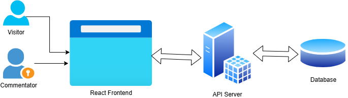

# KapsCric MVP Technical Design Document

## 1. Overview

The KapsCric MVP is a web-based platform for IPL match tracking, enabling Role: admin to manage matches, Role: commentator to provide live ball-by-ball commentary, and Role: visitor to view matches and scoreboards without registration. This document outlines the technical architecture, components, and deployment strategy to meet the SRS requirements within a 4-week timeline, using a JavaScript/TypeScript stack and AWS free-tier deployment.

## 2. System Architecture

### 2.1 Components

- Frontend: Single-page application built with React + TypeScript, styled with Tailwind CSS, hosted via Vite for fast builds.
- Backend: Node.js + Express + TypeScript REST API, handling authentication, match management, and commentary.
- Database: MongoDB for storing users, matches, and commentary data, with a flexible schema.
- Real-Time: WebSocket (via Socket.IO) for live commentary and scoreboard updates.
- Infrastructure: AWS EC2 (t3.micro, free tier) running Docker containers for the app and MongoDB, provisioned with Terraform.
- CI/CD: GitHub Actions for automated testing, building, and deployment to AWS.

### 2.2 Architecture Diagram



## 3. Data Models

### 3.1 User

```TS
interface User {
  _id: ObjectId;
  email: string;
  password: string; // Hashed
  role: 'superadmin' | 'admin' | 'commentator';
  createdAt: Date;
}
```

- Pre-seeded superadmin account in MongoDB.
- Password: ≥8 characters, 1 capital, 1 number, 1 special character.

### 3.2 Match

```TS
interface Match {
  _id: ObjectId;
  team1: string;
  team2: string;
  date: Date; // Stored as ISODate, displayed as D/M/YY or DD/MMM/YYYY
  time: string;
  venue: string;
  status: 'upcoming' | 'live' | 'completed';
  result?: string; // Optional, set for completed matches
  commentators: ObjectId[]; // References User._id
  teamDetails?: {
    team1Players: string[];
    team2Players: string[];
  };
}
```

### 3.3 Commentary

```TS
interface Commentary {
  _id: ObjectId;
  matchId: ObjectId;
  ball: { over: number; ball: number };
  event: 'W' | '0' | '1' | '2' | '3' | '4' | '6' | 'wide' | 'no_ball';
  text?: string; // Optional detailed commentary
  timestamp: Date;
  commentatorId: ObjectId;
}
```

### 3.4 Scoreboard

```TS
interface Scoreboard {
  _id: ObjectId;
  matchId: ObjectId;
  innings: {
    team: string;
    runs: number;
    wickets: number;
    overs: number;
    batsmen: { 
      name: string; runs: number; balls: number; onStrike: boolean }[];
    bowlers: { name: string; overs: number; runs: number; wickets: number }[];
  }[];
}
```

## 4. API Endpoints

### 4.1 Authentication

- `POST /api/auth/login`: Authenticate user (email, password), return JWT.
- `POST /api/auth/register`: Create admin (by superadmin) or commentator (by admin).
- `POST /api/auth/forgot-password`: Send password reset link via email.
- `POST /api/auth/reset-password`: Reset password with token.

### 4.2 Match Management

- `POST /api/matches`: Create match (admin only).
- `PUT /api/matches/:id:` Edit match (admin only).
- `GET /api/matches`: List current/upcoming matches (public).
- `POST /api/matches/:id/commentators`: Assign commentators (admin only).
- `POST /api/matches/:id/team-details`: Set team players (commentator only).

### 4.3 Commentary

- `POST /api/matches/:id/commentary`: Add ball-by-ball commentary (commentator only).
- `GET /api/matches/:id/commentary`: Get live commentary (public).

4.4 Scoreboard

- `GET /api/matches/:id/scoreboard`: Get scoreboard (public).
- `POST /api/matches/:id/scoreboard/innings`: Initialize innings (commentator only).
- `POST /api/matches/:id/scoreboard/batsmen`: Set opening batsmen (commentator only).
- `POST /api/matches/:id/scoreboard/bowler`: Set bowler for over (commentator only).
- `POST /api/matches/:id/scoreboard/update`: Update score after delivery (commentator only).

## 5. WebSocket Events

### Client to Server:
- commentary:add: Send new commentary (commentator only).
- scoreboard:update: Send score updates (commentator only).

### Server to Client:
- commentary:updated: Broadcast new commentary to all clients.
- scoreboard:updated: Broadcast updated scoreboard to all clients.

## 6. Frontend Components

- Homepage: Displays current/upcoming matches (teams, date, time, venue).
- Match Page: Tabs for live commentary and scoreboard, styled per scorecard.png.
Admin Panel:
- Match form (add/edit teams, date, time, venue).
- Commentator assignment.
User creation (admin or commentator).

- Commentator Interface:
  - Team details input (pre-match).
  - Innings setup (batsmen, bowler).
  - Ball-by-ball input (buttons for W, 0, 1, 2, 3, 4, 6, wide, no ball; text field).

- Auth Pages:
  - Login, 
  - forgot password, 
  - reset password.

## 7. Infrastructure

- AWS EC2 t3.micro: Free-tier instance (750 hours/month) running Docker containers.
- Docker:
  - Container 1: Node.js + Express backend.
  - Container 2: MongoDB.
  - Container 3: Nginx for serving frontend and reverse proxy to backend.

- Terraform:
  - Provisions EC2 instance, security groups (HTTP, WebSocket), and IAM roles.
  - Configures Elastic IP for consistent access.

- MongoDB:
  - Local instance in Docker container
  - (no AWS RDS to stay in free tier).
- Networking:
  - AWS VPC with public subnet, security group allowing ports 80 (HTTP), 443 (HTTPS), 3000 (WebSocket).

- CI/CD Pipeline
  - GitHub Actions:
    - Lint and test (ESLint, Jest) on push.
    - Build Docker images for backend and frontend.
    - Deploy to EC2 via SSH, pulling images and restarting containers.


## 8. Repositories:

- kapilsharma/kapscric-backend: Node.js + Express + TypeScript.
- kapilsharma/kapscric-frontend: React + TypeScript.


## 9. Development Plan

- Sprint 1 (Week 1–2):
  - Backend: Authentication (JWT, password reset), user management APIs.
  - Frontend: Login, admin panel for user creation.
  - Infra: Terraform for EC2, Docker setup.
- Sprint 2 (Week 3–4):
  - Backend: Match and commentary APIs, WebSocket integration.
  - Frontend: Match listing, commentator interface, scoreboard.
  - CI/CD: GitHub Actions pipeline, staging deployment.
- Demo: After each sprint, final demo in Week 4.

## 10. Non-Functional Requirements

- Performance: ≤0.5s page load for 30–40 users (optimized with Vite, lazy loading).
- Scalability: MongoDB indexes for matches/commentary, designed for future horizontal scaling.
- Security: JWT tokens, bcrypt for passwords, HTTPS via Nginx.
- Portability: Docker and Terraform ensure AWS/Azure/GCP compatibility.
- Usability: Polished UI per scorecard.png, responsive design.

## 11. Assumptions

- scorecard.png mimics ESPNCricInfo’s layout.
- No external APIs for MVP.
- Single EC2 instance sufficient for 30–40 users.
- Email service (e.g., AWS SES) for password reset within free tier.

## 12. Risks and Mitigations

- `Risk`: EC2 free-tier limits exceeded.
  - `Mitigation`: Monitor usage, optimize Docker containers, use t3.micro.
- `Risk`: WebSocket performance issues.
  - `Mitigation`: Fallback to 5-second polling, optimize Socket.IO.
- `Risk`: Timeline constraints.
  - `Mitigation`: Agile sprints, prioritize core features (match listing, commentary, scoreboard).


