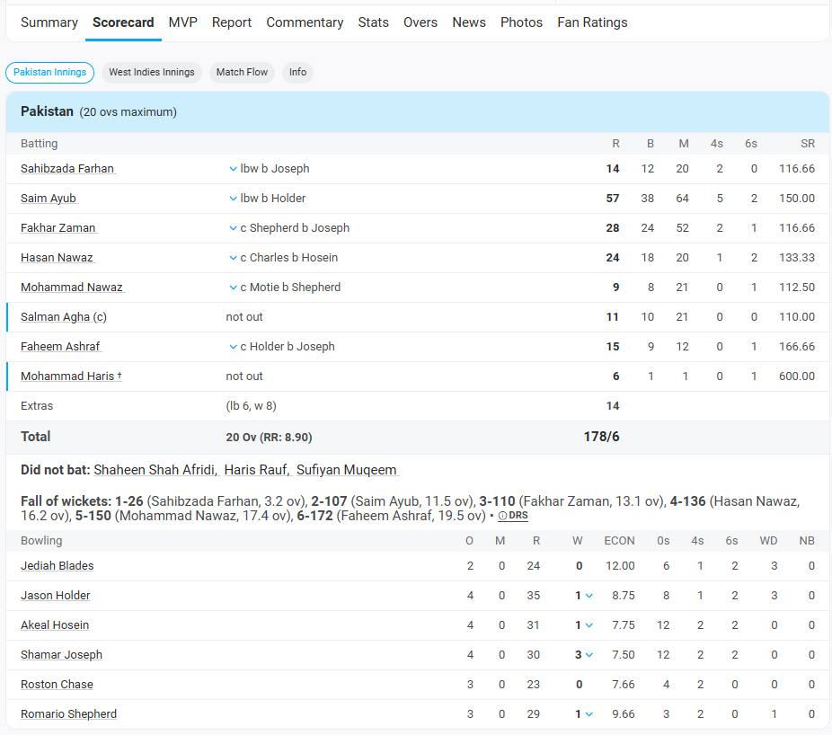

# Mail chain 1

## Prince (Product Owner) to Mac (Customer)

`Subject: Clarification Questions for KapsCric Project Requirements`

Dear Mac,

Thank you for sharing the initial requirements for the KapsCric project, which aims to create a platform similar to ESPNCricInfo. To ensure we fully understand your vision and can develop a detailed Software Requirements Specification (SRS), we have a few follow-up questions. Since you’ve indicated that communication via email or chat is preferred, we’ve outlined our questions below for your convenience. Please provide as much detail as possible, and feel free to share any additional insights or priorities.

### General Questions

**Scope and Scale**: What is the expected user base for the platform (e.g., number of visitors, users, or concurrent viewers per match)? This will help us plan for scalability and performance.
**Geographic Focus**: Are the matches primarily focused on specific regions, leagues, or tournaments (e.g., international cricket, IPL, domestic leagues)? Should the platform support multiple languages or regions?
**Monetization and Access:** Is the platform intended to be free for all users, or are there plans for premium features (e.g., ad-free experience, exclusive content)? Should certain features be restricted to Role: user after login?

### Feature-Specific Questions

#### Upcoming Matches

**Match Data Source:** Where will the data for upcoming matches come from (e.g., manual entry by Role: admin, third-party API, or another source)? If an API is involved, do you have a preferred provider?
**Match Details:** What specific information should be displayed for upcoming matches (e.g., teams, date, time, venue, match type like T20/ODI/Test, or additional details like weather or pitch conditions)?
**Filtering and Sorting:** Should Role: visitor be able to filter or sort upcoming matches (e.g., by date, team, or tournament)?

#### User Management

**Role Hierarchy and Permissions: **

- Can Role: superadmin also perform Role: admin tasks (e.g., adding matches or assigning commentators)?
- Should Role: admin have permissions to edit or delete matches, or only add them?
Are there any limits on the number of Role: commentator users that can be assigned to a match?

- **User Creation Process:** How should Role: admin and Role: commentator accounts be created (e.g., manually by Role: superadmin, through an approval workflow, or self-registration with verification)?
- **Authentication: **Should the platform support specific authentication methods for Role: user, Role: admin, and Role: commentator (e.g., email/password, social login, or multi-factor authentication)?

#### Match Page

**Live Commentary:**

- Should the ball-by-ball commentary be text-based, or are there plans for audio/video commentary in the future?
- How frequently should commentary updates refresh for Role: visitor and Role: user (e.g., real-time via WebSocket, every few seconds)?
- Should Role: commentator have tools to edit or delete their commentary post-submission?

#### Scoreboard:

- What details should the scoreboard include (e.g., runs, wickets, overs, batting/bowling stats, or a graphical representation)?
- Should the scoreboard update in real-time, and if so, what is the acceptable latency?

#### User Comments:
- What is the approval process for comments by Role: user? For example, should Role: commentator manually approve each comment, or is there an automated moderation system?
- Can Role: user edit or delete their comments after submission?
Should comments be visible to all users immediately after approval, or only during specific match events (e.g., tied to a specific delivery)?

**Match Status:**

- How should the platform handle different match states (e.g., upcoming, live, completed)? Should completed matches remain accessible with historical commentary and scores?
- Should Role: visitor have access to live matches without signing up, or is registration required to view live content?

### Technical and Operational Questions

- **Performance Expectations:** Are there specific performance requirements, such as page load times or handling high traffic during popular matches?
- **Analytics and Reporting:** Should the platform include analytics for Role: admin or Role: superadmin (e.g., user engagement, match viewership, or comment activity)?
- **Hosting Preferences:** Do you have a preferred cloud provider (e.g., Azure, AWS, GCP) or specific requirements for hosting, security, or compliance?
- **Integration Needs:** Are there any third-party integrations required (e.g., payment gateways, social media sharing, or analytics tools)?
- **Maintenance and Updates:** After launch, how frequently do you anticipate adding new features or updating match data? Should we plan for automated updates or manual management?

### Project Timeline and Priorities

- **Feature Prioritization:** Which features are most critical to launch first (e.g., match listing, live commentary, or user comments)? Are there any “nice-to-have” features we can defer to later phases?
- **Timeline:** What is your expected timeline for the initial release? Are there specific milestones or deadlines we should align with?

Please feel free to answer these questions at your convenience, either by addressing each numbered point or providing a general response with relevant details. If there are additional stakeholders we should include in this conversation, let us know their contact information. We’re excited to move forward with KapsCric and ensure the platform meets your expectations.

Looking forward to your response.

Best regards,
Prince,
Product Owner,
KapsCric Project Team.

## Reply 1 Mac to Prince

Hi Prince,

Thanks for reaching with specific questions. Let me try to answer them one by one

### General questions

- Scope and scale: Initially, with MVP, let's assume there will be a few thousand users watching while game is in progress. However, we will first have test runs so initially, there will be just 30-40 users watching commentery during test runs.
- Geographic focus: During MVP, we can consider 90% + users will be in India but we need to think and keep options open assuming there will be several thousand users across the world. However, not need to focus on that for the MVP.
- Monetization and access: It is free for everyone and there are no premium features. However, we can consider it after a few years, once product is popular.

### Feature specific questions

- Upcoming matches
  - Match data source: For now, Role: Admin will do it manually.
  - Match details: For MVP, we will focus only on IPL so they will be T20 matches. We just need to show team, date, time and venue.
  - Filtering and sorting: Not during MVP. For now, we will just show current and upcoming matches. No need to show finished match on home page for now but we may have some separate page to see historical matches.
- User Management
  - Superadmin have ability to perform every thing incuding admin's work. However, they  generally will not do it. Role hirarchy is sumeradmin > admin > commentrator > user > Visitor. Higher role can do anything that lower role could do.
  - It is good to have ability to edit/delete matches but not very crucial for the MVP, provided you can do it directly in database, in case needed.
- User Creation process
  - Superadmin will create admin account. Admin will create commentator account. Only extra feature superadmin have over admin is, he can create admin account. Admin cannot create account for other admin.
  - For MVP, we should support email/password authentication. We can work on 2FA after MVP
- Match page
  - Live commentary
    - During MVP, lets keep text based commentery
    - Realtime update will be nice. However, if it is difficuly or will have lot of server load, updating every 5 seconds is fine during MVP.
  - Scoreboard
    - We should cover same details like cricinfo. A screenshot is attached
    - 
  - User comment
    - Let's skip user comment from MVP. Wewill do it later.
- Match status
  - Home page should show only current and upcoming matches. We will have separate page to show historical matches.
  - Yes, visitors can see commentery and scorecard. There is no registration needed.
- Technical and operational questions
  - Performance expectation: Page load time should be minimal, not more than half second. During MVP, to keep server cost low, we can consider there will be only 40-50 visitors max.
  - No analytics and reporting needed during MVP.
  - Hosting preference: AWS is preferred to start with but we should not be bound to AWS. We should be able to switch ot Azure and GCP. There is no compliance requirements.
  - Integration: There is no third party integration planned yet. However, we must have option open for the future.
  - Maintenance: It will be continuous maintenance and updates for new features. However, let's focus on quickly delivering MVP for now.
- Timelines
  - For MVP, we need ability to show matches, do commentery and view live commentery.
  - We expect MVP as soon as possible to showcase the idea to investors. No need for lot of features, as our focus is on fast delivery and approval from stake holders.

Let me know if you have any other questions

Thanks,
Mac,
KAPsCric.
